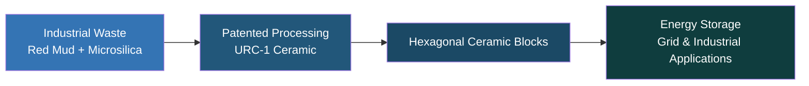

# Upcycled Ceramic Thermal Storage (UCTS) Project

## Turning Waste into Affordable Energy Storage

UCTS (Upcycled Ceramic Thermal Storage) is an innovative solution that converts industrial waste materials (red mud and microsilica) into high-performance ceramic thermal storage blocks for renewable energy applications. Our technology addresses two critical global challenges: high energy storage costs and industrial waste pollution.

---

## Problem Statement

### High Energy Storage Costs
Energy storage currently costs $150-$250/kWh, significantly slowing the adoption of renewable energy sources. This high cost barrier prevents many potential green energy projects from becoming economically viable.

### Massive Waste Pollution
The world generates 177.3 million tons of red mud and microsilica waste annually, with only 2-5% being recycled effectively. This waste pollutes land and water resources, causing significant environmental damage.

---

## The UCTS Solution

Our proprietary process transforms industrial waste into URC-1 ceramic material, which is then fabricated into upcycled thermal storage blocks specifically designed for energy storage applications.

### How UCTS Works

1. **Industrial Waste** - Collecting red mud + microsilica waste materials
2. **URC-1 Ceramic** - Processing into high heat capacity & durability ceramic 
3. **Energy Storage** - Implementation in grid & industrial applications

### Key Advantages
- 💰 **Ultra-Low Cost** - $13.6/kWh (10x cheaper than lithium-ion batteries)
- 🌿 **Eco-Friendly** - 100% waste-based material with high environmental impact
- 📏 **Scalable** - Designed for easy implementation in grid and industrial settings

### Circular Economy Model

---

## Market Opportunity

### Massive Growth Potential

| Market Segment | Current Value | 2030 Projection | Growth (CAGR) | Source |
|----------------|---------------|-----------------|---------------|--------|
| Energy Storage | $295B | $465B | 9.53% | Mordor Intelligence |
| Thermal Storage | $8.5B | $14.2B | 10.93% | ResearchAndMarkets |
| Waste Management | $1.41T | $1.89T | 5.3% | Grand View Research |

### Market Size Comparison ($ Billions)

### Target Markets
- United States
- China
- India

These regions show the highest demand for renewable energy solutions coupled with significant waste management challenges where UCTS provides immediate value.

---

## Competitive Advantage

### Comparison Table

| Technology | Cost ($/kWh) | Eco-Friendly | Scalability |
|------------|--------------|--------------|-------------|
| Lithium-Ion | 150–250 | Low | Medium |
| Sand Batteries | 10–20 | High | Low |
| Standard Ceramics | 50–100 | Medium | High |
| **UCTS** | **13.6** | **High** | **High** |

### Our Edge
- Lowest cost in the market ($13.6/kWh)
- Made entirely from waste materials (red mud and microsilica)
- Highly scalable design for immediate market implementation

### Cost Comparison ($/kWh)

---

## Technology Details

### URC-1 Ceramic Material
- **Composition**: Red mud + microsilica + binders
- **Heat Resistance**: Withstands temperatures up to 1,000°C
- **Durability**: Long-lasting performance with minimal degradation

### System Design
- Hexagonal brick core for optimal heat retention
- Low-cost resistive heating system
- Modular design for easy scalability

```mermaid
flowchart TB
    A[Heat Source<br>Solar/Wind/Excess Grid] --> B[Resistive Heaters]
    B --> C["URC-1 Ceramic Block<br>1000°C Thermal Capacity"]
    C --> D[Heat Exchanger]
    D --> E["Energy Output<br>Steam/Electricity"]
    
    classDef component fill:#f9f9f9,stroke:#333,stroke-width:1px;
    classDef heater fill:#f9f900,stroke:#333,stroke-width:1px;
    class A,E component;
    class B,D component;
	class C heater;
```

---

## Implementation Plan

### Phase 1 Roadmap (12-18 months)

| Phase | Timeline | Focus |
|-------|----------|-------|
| 1 | Months 1-6 | Material development and optimization |
| 2 | Months 7-12 | Lab testing |
| 3 | Months 13-18 | Prototype development |

### Budget Breakdown ($500,000)

- **R&D/Equipment**: $150,000 (30%)
- **Personnel**: $200,000 (40%)
- **Testing/Services**: $100,000 (20%)
- **Marketing/Legal**: $50,000 (10%)

### Key Milestones
- ✓ Prototype by Month 18
- ✓ Field tests by Month 24

---

## Path to Profitability

### Revenue Timeline
- **Year 1**: $1M revenue (pilot sales)
- **Year 3**: $15M revenue (global scaling)

### Revenue Model
- UCTS system sales
- Licensing technology
- Waste partnerships with major producers

### Exit Strategy
- Acquisition by major players (Siemens, Tesla) 
- IPO in 5-7 years

---

## The Driving Force

### Our Team
- **Aleksandr Snigirev** - Founder
  - Materials science and energy expert
  - Sole creator with global vision

- **Anton Zubenko** - Analyst
  - Drives financial modeling 
  - Market strategy development

### Strategic Partnerships
- **Tech firms**: Partnerships with industry leaders like Siemens
- **Waste providers**: Collaboration with companies like Alcoa
- **Research institutes**: Academic partnerships for continued innovation

---

## Get Involved

### Investment Opportunity
We're seeking **$500,000** for Phase 1 development in exchange for equity stake.

### Contact Us
- **Email**: [legalgreenplanet@gmail.com](mailto:legalgreenplanet@gmail.com)
- **Phone**: [+49 160 94940930](tel:+4916094940930)
- **Address**: Bonn, Germany

### Contact Form

---

## Join the UCTS Revolution

Transforming waste into sustainable energy solutions, UCTS offers the perfect intersection of environmental responsibility and economic opportunity. Our innovative approach solves critical global challenges while creating massive value for investors and the planet.

By investing in Phase 1 development, you're not just funding technology—you're helping build a cleaner, more sustainable energy future.

[Contact Us Today](https://ucts.solutions/) to learn more about this investment opportunity.

---

Copyright © 2025 UCTS Project. All rights reserved.
